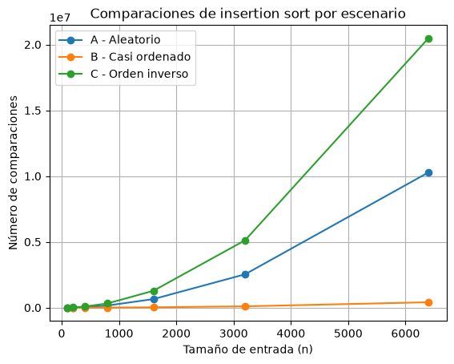
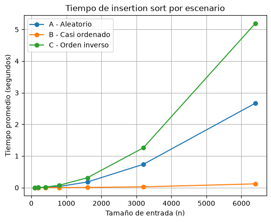
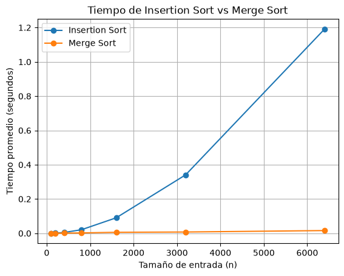

# Laboratorio evaluativo 01
## Fundamentos, complejidad y recurrencias

**Nombre:** Juliana Arenas Arias

## Reproducción del laboratorio

1. Activar el entorno virtual.

2. Instalar las dependencias:

```powershell
pip install -r ../requirements.txt
```

3. Ejecutar la Parte 3:

```powershell
python parte3_casos.py
```

4. Ejecutar la Parte 4:

```powershell
python parte4_complejidad.py
``` 

---

# Parte 1 — Algoritmos como tecnología

## Corrección y eficiencia

Que un algoritmo sea correcto no significa necesariamente que sea la mejor opción para usarlo en un sistema real. En el caso de Tamiza insertion sort sí cumple con ordenar los registros de mayor a menor según el nivel de riesgo entonces en ese sentido funciona bien. El problema aparece con el tiempo que se demora, ahora se tienen que ordenar 1.200.000 registros y solamente hay cuatro horas para hacerlo, desde las 2:00 a.m hasta las 6:00 a.m, entonces, aunque el resultado final quede bien, si el proceso no alcanza a terminar dentro de ese tiempo, en la práctica ya no estaría cumpliendo con lo que necesita el sistema

## Por qué mejorar el hardware no resuelve el problema de fondo

Comprar un servidor dos veces más rápido podría ayudar un poco porque seguramente el proceso terminaría antes, pero no solucionaría el problema de fondo. Insertion sort puede tener un crecimiento cuadrático así que cuando la cantidad de datos aumenta mucho, el trabajo que debe hacer también crece mucho. Por ejemplo si la cantidad de registros se duplica, el trabajo puede llegar a ser aproximadamente cuatro veces mayor, entonces un servidor más rápido podría servir por un tiempo, pero si los datos siguen aumentando, probablemente el mismo problema volvería a aparecer entonces por eso sería mejor revisar primero si el algoritmo que se está usando todavía es adecuado para esa cantidad de información

## Ejemplo propio

Un ejemplo parecido podría pasar en una universidad que recibe unas 100.000 solicitudes de matrícula y necesita organizarlas según la fecha en que llegaron, puede que el programa las ordene correctamente, pero si se demora dos o tres horas y la universidad necesita tener esa lista lista en máximo 30 minutos para empezar a asignar los cupos entonces ese algoritmo ya no sería una buena opción, o sea, el resultado puede estar correcto pero estaría llegando demasiado tarde para lo que realmente necesita el sistema

---

# Parte 2 — Impacto y responsabilidad

## Impacto del uso de un algoritmo ineficiente

Mantener durante mucho tiempo un algoritmo que cada vez se demora más puede terminar generando varios problemas, por ejemplo, si todas las madrugadas el servidor tiene que trabajar durante más horas para terminar el proceso, también va a consumir más recursos y más energía. Puede que un solo día no parezca algo grave pero cuando eso se repite todos los días durante meses o años el gasto se va acumulado

También puede pasar que cada vez que el proceso se vuelve lento, la primera solución sea comprar un servidor más potente, eso puede ayudar por un tiempo, pero también significa gastar más dinero en infraestructura cuando parte del problema realmente puede estar en el algoritmo que se está usando

Además aquí el problema no se queda solamente en los servidores, si el proceso no alcanza a terminar antes de las 6:00 a.m, algunos pacientes podrían no quedar procesados a tiempo y terminar siendo contactados más tarde de lo que deberían, en ese caso quienes más pueden verse afectados son los pacientes. También se complica el trabajo del personal que utiliza la lista, porque tendría que empezar su jornada con información incompleta o con un proceso que todavía no ha terminado, al final, la Secretaría también termina asumiendo costos adicionales en infraestructura, mantenimiento y búsqueda de soluciones

## Responsabilidad del equipo de desarrollo

En este caso el equipo de desarrollo tiene una responsabilidad importante porque no está organizando datos solamente para mostrarlos en un reporte, el orden de la lista se usa para decidir qué pacientes se van a contactar primero, dando prioridad a los que tienen un riesgo más alto

Por eso no basta con que el algoritmo termine, también tiene que ordenar correctamente y hacerlo dentro del tiempo disponible y si algo falla, podría pasar que una persona con mayor riesgo quede después de otra que realmente tenía menos prioridad

Por eso considero que el equipo debería revisar cada cierto tiempo si el algoritmo sigue siendo adecuado para la cantidad de datos que está manejando el sistema, hacer pruebas y medir los tiempos antes de que el problema se vuelva más grande, aveces una decisión técnica puede parecer pequeña, pero en un sistema como este puede terminar afectando directamente a las personas, entonces que una solución haya funcionado durante varios años no significa que necesariamente siga siendo la mejor opción hoy

# Parte 3 — Mejor caso, peor caso y caso promedio
Código utilizado:

- [algoritmos.py](algoritmos.py)
- [datos.py](datos.py)
- [parte3_casos.py](parte3_casos.py)

## 3.1 Análisis previo

Para una entrada de tamaño `n` el mejor caso es cuando los datos ya vienen prácticamente en el orden que necesita el algoritmo y tiene que hacer muy pocos movimientos, el peor caso ocurre cuando los datos vienen en el orden contrario porque insertion sort tiene que mover casi todos los elementos. El caso promedio sería una situación intermedia donde los datos no vienen ni completamente ordenados ni completamente alrevés

Como en Tamiza existe una ventana estricta de cuatro horas, considero que el peor caso es especialmente importante, no sería suficiente saber que normalmente el algoritmo funciona rápido si existe una entrada posible que haga que el proceso se pase de las cuatro horas

Antes de hacer las pruebas esperaba que el escenario B donde el 98% de los datos ya viene ordenado, fuera el más rápido. Para el escenario A, con datos aleatorios esperaba un comportamiento intermedio y por último esperaba que el escenario C fuera el peor porque los datos vienen de menor a mayor y nosotros necesitamos ordenarlos de mayor a menor

## 3.2 Resultados experimentales

Para las pruebas utilicé los tamaños 100, 200, 400, 800, 1600, 3200 y 6400, cada medición de tiempo se realizó tres veces y se tomó el promedio, la generación de los datos se hizo antes de iniciar la medición, para medir solamente el tiempo que tardaba el algoritmo

### Comparaciones



### Tiempo de ejecución



## 3.3 Análisis de resultados

Los resultados fueron bastante parecidos a lo que esperaba antes de hacer las pruebas, el escenario B fue el que necesitó menos comparaciones, mientras que el escenario C fue claramente el que más trabajo necesitó, el escenario A quedó en un punto intermedio

Esto se nota bastante con `n = 6400`. En el escenario B se hicieron 409.004 comparaciones, en el escenario A fueron 10.276.753 y en el escenario C llegaron a 20.476.800 comparaciones

En los tiempos pasó algo parecido, con 6400 datos, el escenario B tardó aproximadamente 0,119 segundos, el escenario A alrededor de 2,671 segundos y el escenario C cerca de 5,195 segundos, aunque los tiempos pueden cambiar un poco entre una ejecución y otra, la diferencia entre los tres escenarios se mantiene

También se puede ver que cuando aumenta el tamaño de la entrada, el escenario inverso crece mucho más rápido, esto tiene sentido porque insertion sort tiene que comparar y mover muchos más elementos cuando la lista viene exactamente en el orden contrario al que necesitamos

En general las pruebas confirmaron la predicción inicial, el escenario B se comportó como el mejor de los tres, el escenario A como un caso intermedio y el escenario C como el peor caso

# Parte 4 — Complejidad y comparación de algoritmos

## 4.1 Análisis teórico

### Recurrencia de Merge Sort

Merge sort funciona dividiendo la lista en dos partes hasta llegar a listas de un solo elemento, después empieza a unir esas partes nuevamente comparando los elementos para dejarlos en el orden correcto

Por eso su recurrencia se puede representar como:

$$
T(n) = 2T(n/2) + \Theta(n)
$$

El término `2T(n/2)` aparece porque el algoritmo hace dos llamadas recursivas, una para cada mitad de la lista, el término `Θ(n)` corresponde al trabajo que se hace al mezclar las dos mitades

Si se observa como un árbol de recurrencia, en el primer nivel se trabaja con `n` elementos, en el siguiente nivel hay dos problemas de tamaño `n/2`, por lo que entre los dos también se procesa aproximadamente `n`, esto se repite en cada nivel

La cantidad de niveles se puede obtener dividiendo la entrada entre 2 hasta llegar a 1:

$$
\frac{n}{2^k} = 1
$$

Por lo tanto:

$$
k = \log_2(n)
$$

Como en cada nivel se realiza un trabajo de aproximadamente `n` y existen `log₂(n)` niveles, el tiempo total queda:

$$
T(n) = \Theta(n \log n)
$$

Por eso merge sort mantiene un crecimiento de `n log n` incluso cuando aumenta bastante la cantidad de datos

### Análisis de Insertion Sort

Insertion sort funciona tomando cada elemento y buscando dónde debe quedar dentro de la parte de la lista que ya se encuentra ordenada

En el mejor caso los datos ya vienen en el orden que necesitamos, en nuestro caso sería de mayor a menor, entonces cada elemento solamente necesita una comparación con el elemento anterior y prácticamente no se realizan desplazamientos

Para una lista de tamaño `n`, se hacen aproximadamente:

$$
n - 1
$$

comparaciones, por lo que el mejor caso es:

$$
\Theta(n)
$$

En el peor caso sucede lo contrario, los datos vienen completamente al revés, así que cada nuevo elemento debe compararse con todos los elementos anteriores

La cantidad de comparaciones sería:

$$
1 + 2 + 3 + \dots + (n - 1)
$$

Esta suma se puede representar como:

$$
\frac{n(n-1)}{2}
$$

Por eso el peor caso tiene una complejidad de:

$$
\Theta(n^2)
$$

En un caso promedio, como una lista aleatoria, algunos elementos necesitan pocas comparaciones y otros muchas, aunque no siempre se hacen todas las comparaciones del peor caso, la cantidad sigue creciendo de forma cuadrática por lo que el caso promedio también es:

$$
\Theta(n^2)
$$

### Tabla de complejidades

| Algoritmo | Mejor caso | Caso promedio | Peor caso |
|---|---|---|---|
| Insertion Sort | Θ(n) | Θ(n²) | Θ(n²) |
| Merge Sort | Θ(n log n) | Θ(n log n) | Θ(n log n) |

## 4.2 Comparación experimental

Para comparar los dos algoritmos utilicé el escenario A, es decir, datos en orden aleatorio, se probaron los mismos tamaños para ambos algoritmos: 100, 200, 400, 800, 1600, 3200 y 6400 elementos

Cada medición se realizó tres veces y se tomó el promedio, la generación de los datos se hizo antes de medir el tiempo para que la comparación tuviera en cuenta solamente la ejecución de los algoritmos



En la gráfica se puede ver que al principio, cuando la cantidad de datos es pequeña, la diferencia entre los dos algoritmos no parece tan grande, sin embargo a medida que aumenta el tamaño de la entrada, insertion sort empieza a tardar mucho más, mientras que merge sort sigue creciendo de una forma mucho más lenta

Por ejemplo con `n = 6400`, insertion sort tardó aproximadamente `1,191566 segundos`, mientras que merge sort tardó `0,015960 segundos`, la diferencia ya es muy grande incluso con una entrada que todavía es pequeña comparada con los 1.200.000 registros que debe procesar Tamiza

Estos resultados también coinciden con lo visto en el análisis teórico. Insertion sort tiene un comportamiento promedio de `Θ(n²)`, mientras que merge sort mantiene `Θ(n log n)`, por eso cuando aumenta la cantidad de datos, la diferencia entre los dos se vuelve cada vez más evidente

En este experimento merge sort tuvo un mejor comportamiento para los datos aleatorios y parece ser una opción mucho más adecuada cuando se espera trabajar con cantidades grandes de información

## 4.3 Concepto técnico para Tamiza

Después de comparar los dos algoritmos, considero que para Tamiza sería más conveniente utilizar merge sort como algoritmo de ordenamiento. Una de las razones principales es que no siempre se puede saber en qué orden van a llegar los datos y como vimos en las pruebas, insertion sort funciona muy bien cuando la lista ya viene casi ordenada, pero su comportamiento cambia mucho cuando los datos llegan aleatorios o completamente al contrario

Esto es importante porque en producción se necesita una sola implementación que pueda responder bien sin depender de cómo llegue la información cada día. Merge sort tiene un comportamiento de `Θ(n log n)` en el mejor caso, promedio y peor caso, por lo que su tiempo es mucho más predecible que el de insertion sort

En las pruebas con datos aleatorios y `n = 6400`, insertion sort tardó aproximadamente `1,191566 segundos`, mientras que merge sort tardó `0,015960 segundos`, apartir de esos datos se puede hacer una estimación de lo que podría pasar con los 1.200.000 registros de Tamiza, es importante aclarar que esto es solamente una estimación que se basa en las mediciones realizadas y en la complejidad de cada algoritmo, no una prueba real con 1.200.000 registros

Para insertion sort, tomando su crecimiento promedio como `n²`, la estimación sería:

$$
1.191566
\left(
\frac{1\,200\,000}{6400}
\right)^2
$$

El resultado es aproximadamente `41.891 segundos`, que serían unas `11,64 horas`

Para merge sort se puede usar su crecimiento `n log n`:

$$
0.015960
\frac{1\,200\,000 \log_2(1\,200\,000)}
{6400 \log_2(6400)}
$$

El resultado aproximado sería de `4,78 segundos`

Estos valores no significan que en el servidor real los algoritmos necesariamente van a tardar exactamente eso porque también influyen el procesador, la memoria, otros procesos del sistema y la forma en que se manejan los datos, sin embargo, sirven para mostrar la gran diferencia en la forma en que escalan los dos algoritmos

Sobre la propuesta de comprar un servidor dos veces más rápido, posiblemente mejoraría los tiempos pero seguiría sin solucionar el problema de fondo, incluso suponiendo de forma optimista que el nuevo servidor redujera a la mitad el tiempo estimado de insertion sort, pasaríamos de unas `11,64 horas` a aproximadamente `5,82 horas`, que todavía estaría por encima de la ventana máxima de cuatro horas, en cambio, cambiar el algoritmo ataca directamente el problema de escalabilidad

También hay que tener en cuenta que merge sort necesita memoria adicional para dividir y mezclar las listas, mientras que insertion sort utiliza menos memoria extra, aun así, para este caso considero más importante tener un tiempo de ejecución más estable y poder cumplir con la ventana establecida, especialmente porque el resultado se utiliza para priorizar pacientes según su nivel de riesgo